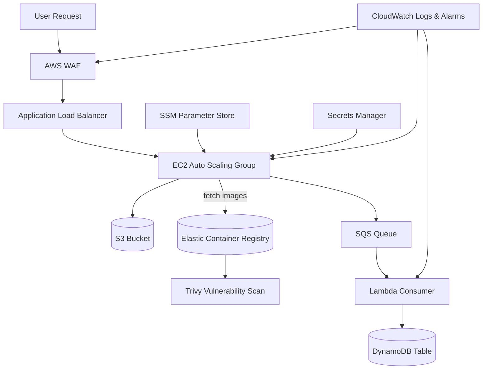

# AWS Cloud Infrastructure Project – Secure & Scalable Web App

This project demonstrates a **production-grade AWS architecture** with compute, storage, networking, monitoring, and DevSecOps practices. It was built to simulate a real-world cloud deployment with **scalability, security, and cost optimization** in mind.

---

## 🏗️ Architecture Diagram

## 🔑 Key Features

### Networking & Compute
- VPC with public/private subnets, NAT Gateway, and Security Groups.  
- **EC2 Auto Scaling Group** behind an Application Load Balancer (ALB).  
- Private subnet isolation for sensitive resources.  

### Serverless Processing
- **SQS queue + Lambda consumer** → processes events and stores results in DynamoDB.  

### Storage & Data
- **Amazon S3** for static storage, logging, and lifecycle policies (to Glacier/IA).  
- **DynamoDB** for low-latency, scalable database operations.  

### Security & DevSecOps
- **AWS WAF** in front of ALB for SQLi/XSS filtering and rate limiting.  
- **Amazon ECR** for container images with lifecycle policies.  
- **Trivy** scans for Docker images before pushing to ECR.  
- **AWS Secrets Manager** for database/application secrets.  
- **AWS SSM Parameter Store** for non-sensitive config parameters.  
- IAM roles with least privilege access.  

### Monitoring & Logging
- **CloudWatch Logs** and **CloudWatch Alarms** for EC2, Lambda, and WAF.  
- **S3 bucket access logs** with lifecycle retention policies.  
- Infrastructure logging for auditing and troubleshooting.  

---

## ⚙️ Tools & Technologies
- **AWS Services**: EC2 • ALB/ASG • VPC • S3 • DynamoDB • Lambda • SQS • ECR • WAF • Secrets Manager • SSM • CloudWatch  
- **DevOps Tools**: Docker • Trivy • Bash • Terraform (optional for IaC)  
